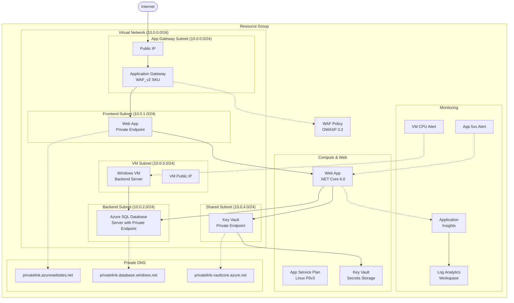
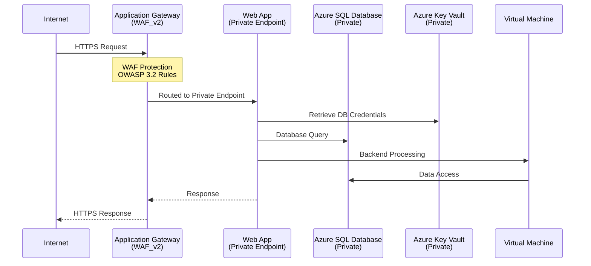

# Architecture

This document describes the Azure resources deployed by [infra/main.bicep](../infra/main.bicep), the Azure Verified Modules (AVM) used, and the network topology for the Contoso Hotels demonstration.

## Core Architecture Components

This infrastructure deploys a secure, production-ready web application with the following components:

### Always Deployed Resources

| Resource | Purpose | AVM Reference |
|----------|---------|---------------|
| Resource Group | Container for all resources | [avm/res/resources/resource-group](https://github.com/Azure/bicep-registry-modules/tree/main/avm/res/resources/resource-group) |
| Virtual Network | Network foundation with 5 subnets | [avm/res/network/virtual-network](https://github.com/Azure/bicep-registry-modules/tree/main/avm/res/network/virtual-network) |
| **Key Vault** | **Secure secrets storage with private endpoint** | **[avm/res/key-vault/vault](https://github.com/Azure/bicep-registry-modules/tree/main/avm/res/key-vault/vault)** |
| Log Analytics Workspace | Centralized monitoring and diagnostics | [avm/res/operational-insights/workspace](https://github.com/Azure/bicep-registry-modules/tree/main/avm/res/operational-insights/workspace) |
| Application Insights | Application monitoring and telemetry | [avm/res/insights/component](https://github.com/Azure/bicep-registry-modules/tree/main/avm/res/insights/component) |
| App Service Plan (Linux) | Hosting plan for web applications | [avm/res/web/serverfarm](https://github.com/Azure/bicep-registry-modules/tree/main/avm/res/web/serverfarm) |
| Web App (App Service) | .NET Core 6.0 web application with private endpoint | [avm/res/web/site](https://github.com/Azure/bicep-registry-modules/tree/main/avm/res/web/site) |
| Azure SQL Database Server | Database backend in private subnet | [avm/res/sql/server](https://github.com/Azure/bicep-registry-modules/tree/main/avm/res/sql/server) |
| Application Gateway | Web application firewall and load balancer | [avm/res/network/application-gateway](https://github.com/Azure/bicep-registry-modules/tree/main/avm/res/network/application-gateway) |
| WAF Policy | Web Application Firewall protection | [avm/res/network/application-gateway-web-application-firewall-policy](https://github.com/Azure/bicep-registry-modules/tree/main/avm/res/network/application-gateway-web-application-firewall-policy) |
| Windows Virtual Machine | Backend processing server | [avm/res/compute/virtual-machine](https://github.com/Azure/bicep-registry-modules/tree/main/avm/res/compute/virtual-machine) |
| Private DNS Zones (3) | DNS resolution for App Service, Azure SQL Database, and Key Vault | [avm/res/network/private-dns-zone](https://github.com/Azure/bicep-registry-modules/tree/main/avm/res/network/private-dns-zone) |
| Public IP Addresses (2) | For Application Gateway and VM | [avm/res/network/public-ip-address](https://github.com/Azure/bicep-registry-modules/tree/main/avm/res/network/public-ip-address) |

### Monitoring & Alerting

| Resource | Purpose | AVM Reference |
|----------|---------|---------------|
| VM CPU Alert | Alerts when VM CPU > 80% for 5 minutes | [avm/res/insights/metric-alert](https://github.com/Azure/bicep-registry-modules/tree/main/avm/res/insights/metric-alert) |
| App Service 5xx Alert | Alerts on HTTP 5xx errors > 5 in 5 minutes | [avm/res/insights/metric-alert](https://github.com/Azure/bicep-registry-modules/tree/main/avm/res/insights/metric-alert) |

### Architecture Diagram

The following mermaid diagram illustrates the architecture of the deployed resources:

## Network Topology

### Virtual Network Subnets

The virtual network (10.0.0.0/16) is segmented into five subnets for security and functionality:

| Subnet | Address Prefix | Purpose | Resources |
|--------|---------------|---------|-----------|
| `snet-appgw` | 10.0.0.0/24 | Application Gateway | Application Gateway |
| `snet-frontend` | 10.0.1.0/24 | Frontend services | Web App Private Endpoint |
| `snet-backend` | 10.0.2.0/24 | Backend database services | Azure SQL Database Server |
| `snet-vm` | 10.0.3.0/24 | Virtual machine services | Windows Virtual Machine |
| `snet-shared` | 10.0.4.0/24 | Shared services | Key Vault Private Endpoint |

> **Note:** The backend subnet is used for the Azure SQL Database private endpoint. The shared subnet hosts security-related services like Key Vault with private endpoints.

### Traffic Flow

### Security Features

1. **Network Isolation**
   - Web App accessible only via private endpoint   - Azure SQL Database accessible only via private endpoint
   - **Key Vault accessible only via private endpoint in shared subnet**
   - No public database or secrets access

2. **Secrets Management**
   - **Azure Key Vault stores all sensitive credentials**
   - **Database credentials secured in Key Vault with RBAC authorization**
   - **Purge protection and soft delete enabled**
   - **Private endpoint ensures no public access to secrets**

3. **Web Application Firewall**
   - OWASP Core Rule Set v3.2
   - Microsoft Bot Manager Rule Set v0.1
   - Prevention mode (blocks threats)
   - 100 MB file upload limit

4. **Monitoring & Alerting**
   - All resources send diagnostics to Log Analytics
   - **Key Vault audit logs captured in Log Analytics**
   - VM CPU alerts when > 80% for 5 minutes
   - App Service alerts on HTTP 5xx errors > 5 in 5 minutes

5. **Managed Identities**
   - Web App uses system-assigned managed identity
   - **RBAC-based access to Key Vault secrets**
   - Secure authentication to Azure services

6. **Private DNS Resolution**
   - Private DNS zones for App Service, Azure SQL Database, and Key Vault
   - VNET-linked for proper name resolution

## Security & Best Practices

1. **Zero Trust Architecture** – No direct public access to backend services
2. **Defense in Depth** – Multiple security layers (WAF, private endpoints, network segmentation)
3. **Centralized Monitoring** – All resources forward logs to Log Analytics workspace
4. **Infrastructure as Code** – Deployed using Azure Verified Modules for consistency
5. **Tagging Strategy** – All resources tagged with `azd-env-name` and `projectName`
6. **Encryption** – TLS 1.2 minimum, HTTPS only for web applications
7. **Patch Management** – Automatic OS updates enabled for VM
8. **Resource Naming** – Consistent naming using Azure abbreviations
9. **Secrets Management** – All sensitive data stored in Azure Key Vault with RBAC
10. **Private Connectivity** – All PaaS services use private endpoints for secure communication

## Configuration Parameters

Key parameters that can be customized during deployment:

| Parameter | Description | Default | Key Vault Storage |
|-----------|-------------|---------|-------------------|
| `location` | Azure region for deployment | Required | - |
| `environmentName` | Environment name (dev/test/prod) | Required | - |
| `vmAdminUsername` | VM administrator username | Required | - |
| `vmAdminPassword` | VM administrator password | Required (secure) | - |
| `sqlAdminLogin` | SQL Database admin username | Required | ✅ Stored as secret |
| `sqlAdminPassword` | SQL Database admin password | Required (secure) | ✅ Stored as secret |
| `sqlServerSkuName` | SQL Database SKU name | Basic | - |
| `sqlServerSkuTier` | SQL Database tier | Basic | - |
| `sqlDatabaseMaxSizeGB` | SQL Database max size in GB | 2 | - |
| `enableEncryptionAtHost` | Enable VM encryption at host | false | - |

> **Security Note:** Database credentials are automatically stored as secrets in Azure Key Vault during deployment. This follows Azure security best practices by ensuring sensitive credentials are never exposed in configuration files or deployment logs.

This architecture provides a secure, scalable foundation for the Contoso Hotels demonstration while following Azure Well-Architected Framework principles.
